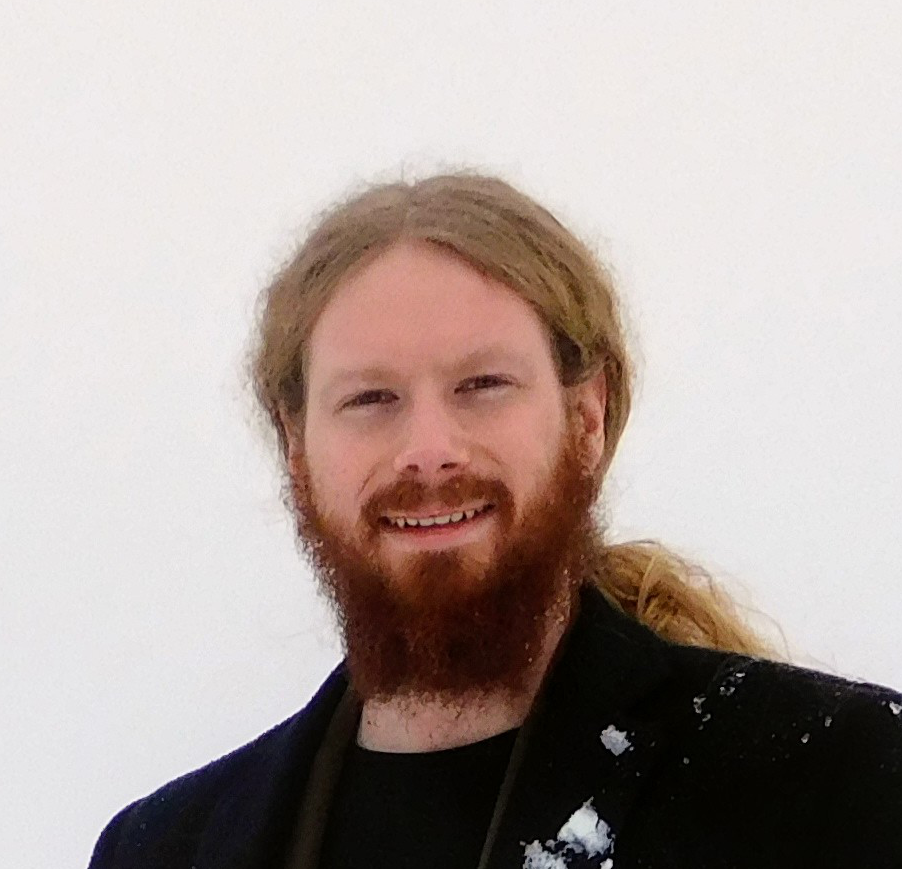
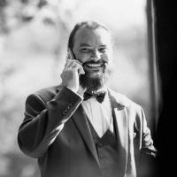

# TomOpt Authors

The TomOpt project, and its continued development and support, is the result of the combined work of many people, whose contributions are summarised below.

In order to start time, the TomOpt authors/contributors are: Giles Strong, Tommaso Dorigo, Andrea Giammanco, Pietro Vischia, Jan Kieseler, Maxime Lagrange, Federico Nardi, Haitham Zaraket, Max Lamparth, Federica Fanzago, Oleg Savchenko, Nitesh Sharma, Anna Bordignon.

## Giles Chatham Strong (@GilesStrong)

### 2021 - present. University of Padova, Italy; INFN-Padova, Italy.

### Code contributions:

- Basic elements for all aspects of TomOpt:
  - Inference, muon, optimisation, plotting, & volume modules + unit tests
  - Voxel and panel detectors
- TomOpt repo establishment (boiler-plate files, CI/CD etc.)
- Inference via GNNs (VoxelNet)
- Conceptual planning, implementation, & investigation for:
  - ULorry benchmark
  - Bimodal test-statistic for classification with X0 predictions
- Implementation of:
  - Geant 4 parameterised scattering model in TomOpt
  - PhiDet benchmark
- Tutorial writing
- Code reviews

### Other roles:

- Project management
- Project conceptualisation
- Meeting chairperson, presentations
- Dedicated talks on TomOpt

## Tommaso Dorigo (@tdorigo)

### 2021 - present. INFN-Padova, Italy.

### Code contributions:

- Assistance and support during writing of basic aspects of TomOpt
- Formula derivations for:
  - PDG scattering models
  - Muon track-fitting
  - PhiDet muon track-fitting
- Investigation and development of Geant 4 parameterised scattering model
- Conceptual planning for:
  - Maximum likelihood estimate for X0 inference
  - ULorry benchmark
  - Bimodal test-statistic for classification with X0 predictions
  - PhiDet detector benchmark

### Other roles:

- Project conceptualisation
- Project management
- Supervision (G. Strong, A Bordignon, F. Nardi, Oleg Savchenko)
- Funding acquisition (G. Strong, A Bordignon, F. Nardi, Oleg Savchenko)
- Meeting presentations
- Advertisement/mention of TomOpt in talks

## Andrea Giammanco (@giamman)

### 2021 - present. Université catholique de Louvain, Belgium.

### Code contributions:

- Assistance, advice, and information for various aspects of muon tomography

### Other roles:

- Funding acquisition (M. Lagrange)
- Supervision (M. Lagrange, P. Vischia?)
- Meeting attendence
- Advertisement/mention of TomOpt in talks

## Pietro Vischia (@vischia)

### 2021 - present. Université catholique de Louvain, Belgium.

### Code contributions:

- Conceptual planning, implementation, and investigation of maximum likelihood estimate for X0 inference
- Conceptual planning for:
  - ULorry benchmark
  - Bimodal test-statistic for classification with X0 predictions
- Tutorial feedback

### Other roles:

- Supervision (M. Lagrange?)
- Meeting presentations
- Advertisement/mention of TomOpt in talks

## Jan Kieseler (@jkiesele)

### 2021 - present. CERN, Switzerland.

### Code contributions:

- Geant 4 data for parametrised scattering model
- Advice and assistance on custom PyTorch and CUDA kernels

### Other roles:

- Advertisement/mention of TomOpt in talks

## Maxime Lagrange (@MaximeLagrange)

### 2021 - present. Université catholique de Louvain, Belgium.

### Code contributions:

- Investigation of:
  - Detector scattering of muons
  - Momentum estimation
  - Angular statistics reconstruction method for volume inference
- Assistance with muon coordinate-system
- Assistance, advice, and information for various aspects of muon tomography

### Other roles:

- Meeting presentations
- Dedicated talks on TomOpt

## Federico Nardi (@FedericoNardi)

### 2021 - 2022?. INFN-Padova, Italy.

### Code contributions:

- Improved muon-generation model

### Other roles:

- Meeting presentations

## Haitham Zaraket (@hzaraket)

### 2021 - present. Lebanese University, Lebanon.

### Code contributions:

- Improved muon-generation model
- Tutorial feedback

### Other roles:

- Meeting presentations

## Max Lamparth (@maxlampe)

### 2021 - present. Technische Universität München, Germany.

### Code contributions:

- Gaussian mixture-models for detector modelling (Heatmap Detectors)

### Other roles:

- Meeting presentations
- Advertisement/mention of TomOpt in talks

## Federica Fanzago (@fanzago)

### 2021 - present. INFN-Padova, Italy.

### Code contributions:

- 

### Other roles:

- Meeting attendance

## Oleg Savchenko (@intfxdx)

### 2022 - present. INFN-Padova, Italy.

### Code contributions:

- 

### Other roles:

- Meeting attendance

## Nitesh Sharma

### 2022 - 2022?. Institute?, India?.

### Code contributions:

- Investigation and development of Geant 4 parameterised scattering model?

### Other roles:

- 

## Anna Bordignon (@Anna5997)

### 2022 - present. INFN-Padova, Italy.

### Code contributions:

- Conceptual planning, implementation, and investigation of maximum likelihood estimate for X0 inference
- Formula derivations for PhiDet muon track-fitting

### Other roles:

- Meeting attendance

## Name Surname (@Github_name)

### start year - end year / present. Institute, Country.

### Code contributions:

- list

### Other roles:

- Other roles + CRediT roles

# [CRediT Roles reference](https://casrai.org/credit/)

Complete list of the 14 roles, but authors should probably only note the following relevant roles:

- Project conceptualisation
- Funding acquisition
- Project management
- Supervision

Other roles that are likely covered already by code contributions:

- Data curation
- Formal Analysis
- Investigation
- Methodology
- Validation
- Visualisation
- Software

Remaining roles that will vary by publication:

- Resources (Hardware)
- Writing – original draft
- Writing – review & editing
