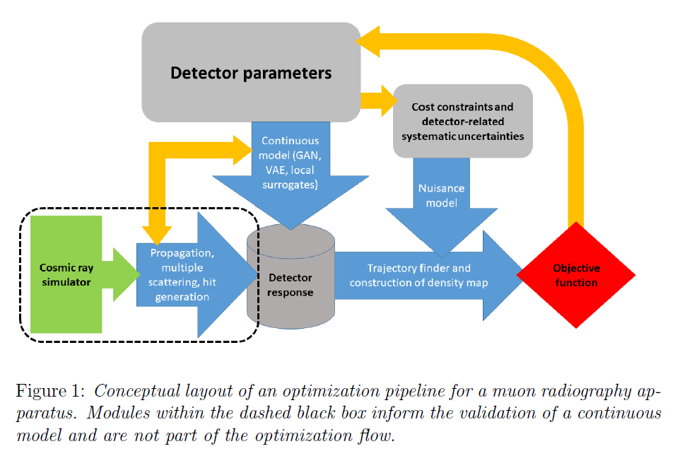
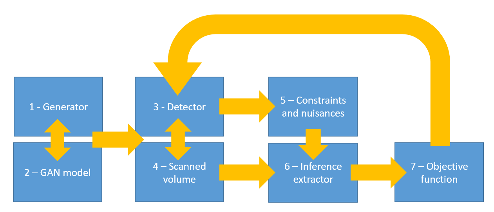

[](https://github.com/GilesStrong/mode_muon_tomography/actions)
[](https://github.com/GilesStrong/mode_muon_tomography/actions)
[](https://github.com/psf/black)

# TomOpt: Differential Muon Tomography Optimisation

## Installation


N.B. Whilst the repo is private, you will need to make sure that you have registered the public ssh key of your computer/instance with your [GitHub profile](https://github.com/settings/keys). Follow [these instructions](https://docs.github.com/en/github/authenticating-to-github/connecting-to-github-with-ssh/checking-for-existing-ssh-keys) to check for existing keys or [these](https://docs.github.com/en/github/authenticating-to-github/connecting-to-github-with-ssh/generating-a-new-ssh-key-and-adding-it-to-the-ssh-agent) to generate a new key. After that follow [this](https://docs.github.com/en/github/authenticating-to-github/connecting-to-github-with-ssh/adding-a-new-ssh-key-to-your-github-account) to associate the key.

Checkout package:

```
git clone git@github.com:GilesStrong/mode_muon_tomography.git
cd mode_muon_tomography
```

Minimum python version is 3.8. Recommend creating a virtual environment, e.g. assuming your are using [Anaconda](https://www.anaconda.com/products/individual)/[Miniconda](https://docs.conda.io/en/latest/miniconda.html) (if installing conda for the first time, remember to restart the shell before attemting to use conda, and that by default conda writes the setup commands to `.bashrc`):

```
conda env create -f environment.yml
conda activate tomopt
```

Otherwise set up a suitable environment using your python distribution of choice using the contents of `environment.yml`. Remember to activate the correct environment each time, via e.g. `conda activate tomopt`.

Install package and dependencies
```
pip install -r requirements.txt
pip install -e .
```

Install git-hooks:

```
pre-commit install
```

## Testing

Testing is handled by `pytest` and is set up to run during pull requests. Tests can be manually ran locally via:

```
pytest tests/
```

to run all tests, or, e.g.:

```
pytest tests/test_muon.py
```

## Description

This document summarizes the proposed functionalities of the building blocks of an optimization pipeline for a muon tomography scanner. A graphical overview of the pipeline is shown below.



The pipeline may be constructed by assembling the following modular blocks:

1. A generator of muons hitting the outer surfaces of the volumes of interest (detection elements + scanned volume)
1. A GAN learning to approximate the generator output
1. A module describing the geometry of the detection elements and their layout, also capable of returning reconstructed hits for crossing muons, and of propagating muons through the detector volume
1. A module describing the scanned volume and its effect on muon trajectories and propagation
1. A module determining constraints and nuisances based on the parameters of module 3 and outputting information to module 6
1. A module creating a model of the inference of relevance (e.g. a voxelized map of the scanned volume) given the input data
1. An objective function, taking as input the inference of module 5 and the detector parameters and data-taking details (integration time etc.)


A simpler sketch of the interconnection of these modules is provided below.



A simplification of the above scheme can be implemented by substituting modules 1 and 2 with a simpler version of module 1, which should only provide a simplified parametrization of cosmic muons, with a probability density only dependent on two variables. 

We may simply formalize the functionalities of these modules by specifying what inputs they receive, from which module, what operations they are capable of performing, and what outputs they yield, and to which other module in the chain.

### Generator module

The generator module is tasked with generating muons impinging in the experimental apparatus. The generator may be a simple sampler of a two-dimensional p, theta prior, or a more elaborate simulation of cosmic rays. For development, this should be however as simple as possible.

The generator module takes the following inputs:

- (user-specified) Location on Earth’s surface (latitude, longitude, elevation)
- (user-specified) Time (hour, day of the year)
- (user-specified) Angular range of generated muons, in degrees from the vertical for simplicity; a - generation in an angular range not centered on the vertical can be implemented as needed (e.g. 0-90 - degrees)
- (user-specified) Momentum range of generated muons, in GeV (min and max considered values, e.g. 0.1 GeV - infinity)
- (user-specified) Maximum number of simultaneous generated muons (Nmax, normally set to 1)
- (from Module 3) Dimensions of the surface of interest impinged by muons. For simplicity, we may take this as a rectangular, flat surface, thus defined by four 3D coordinate points of its extrema, or other equivalent parametrization. This is provided either by the user, or (during a geometry optimization run) by Module 3

The Generator module produces the following outputs:

- The number of generated simultaneous muons
- A position (x,y,z) on the surface, for each generated muon
- A three-momentum vector (px,py,pz), for each generated muon
- A charge (+ or -) for each generated muon

No proper time from production is necessary, as the exponential decay law does not need it.

The Generator module should have the following functionalities:

- Generate single or multiple muons (up to Nmax) at the same time

The Generator module may output to Module 2 (GAN) or Module 3 (Detector)

### GAN model

The GAN model is tasked with producing a model of the generator output, to be used for differentiable applications. 

The GAN model  takes the following inputs:

- (user-specified) GAN architecture hyperparameters
- (from module 1) Number of muon events in a batch generated by module 1
- (from module 1) The number of generated simultaneous muons in each event generated by module 1
- (from module 1) A position (x,y,z) on the surface, for each muon generated by module 1 
- (from module 1) A three-momentum vector (px,py,pz), for each muon generated by module 1
- (from module 1) A charge (+ or -) for each muon generated by module 1

The GAN model produces the following output:

- The number of generated simultaneous muons in each event 
- A position (x,y,z) on the surface, for each muon 
- A three-momentum vector (px,py,pz), for each muon 
- A charge (+ or -) for each muon 
- Evaluation metrics 

The GAN should have the following functionalities:

- Take batches of events in input from Module 1, train internal parameters of a model to generate muons with same characteristics
- Use trained model parameters to output muon events to Module 3
- Evaluate model precision by comparing to validation batch of events generated by Module 1, producing statistics to the user.

The GAN module may output to module 3 (Detector) or to the user (evaluation metrics) 

### Detector model

The detector module contains a specification of the geometry and layout of the active detection elements, their material map, and the intrinsic resolution of each detection element. The task of the detector model is to produce a digitized hit representation of the detector response to traversing muons, as well as to perform the propagation of muons inside its volume.

The detector model takes the following inputs:

- (user specified, or from Module 7) number of detection modules for each kind considered 
- (user specified, or from Module 7) initial geometry parameters of each module, material composition of each composing volume
- (user specified, or from Module 7) initial positioning information for each module
- (user specified) individual precision of the position measurement of each detection element, encoded as a 3D 1-sigma volume (for a multiwire chamber, e.g., this is a box of length equal to the wire length, and with transversal dimensions given by the precision of positioning of the wire in one coordinate, and by the wire hit resolution in the measurement coordinate). We refrain from modeling the physical processes of detection, such as ionization and drift, modeling in its stead directly the hit generation)
- (user specified) Noise rate of each detection element (optional, can be omitted in an initial simplified description)
- (from Module 1 or Module 2) Number of muons in the processed event
- (from Module 1 or Module 2) State of each muon (initial position and momentum, charge)

The detector model produces the following outputs:

- Number of muons exiting the detector (to Module 4)
- State of each muon (final position and momentum, charge) (to Module 4)
- List of recorded hits and their precision (3D 1-sigma volumes) (to Module 5)
- Its own parameters (to Module 6)

The detector model should have the following functionalities:

- Allow the propagation of muons through the detector volume, modeling multiple scattering, energy loss, and absorption
- Produce a list of hits with their characteristics

The detector model outputs to Module 4, Module 5, and Module 6.

### Scanned volume module

The scanned volume module provides a description of the investigated material. The module allows for the propagation of muons accounting for the material distribution.

The scanned volume module takes the following inputs:

- Description of each volume element and material, and its position
- Number of muons in the processed event
- State of each muon (initial position and momentum, charge)

The scanned volume module produces the following outputs:

- Number of muons exiting the detector (to Module 3)
- State of each muon (final position and momentum, charge) (to Module 3)

The scanned volume module should have the following functionalities:

- Allow the propagation of muons through the volume, modeling multiple scattering, energy loss, and absorption

The scanned volume module outputs to Module 3.
